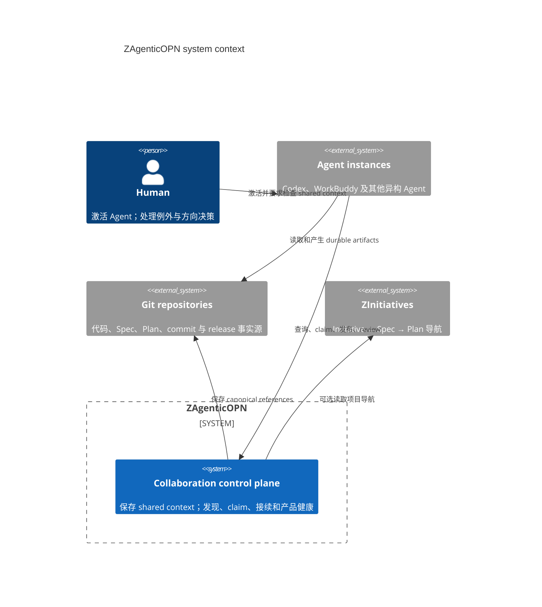
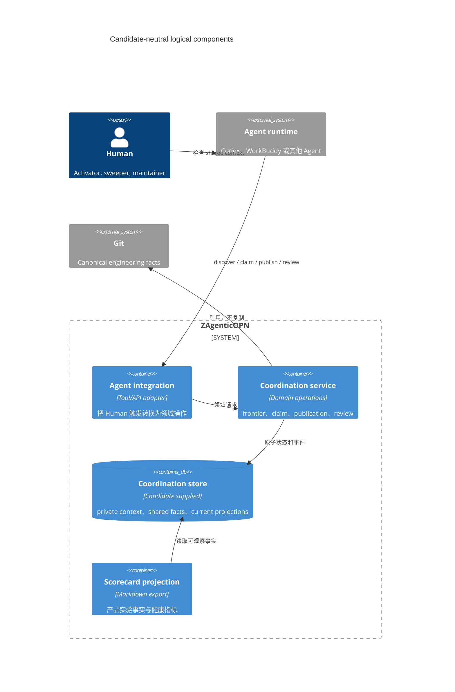
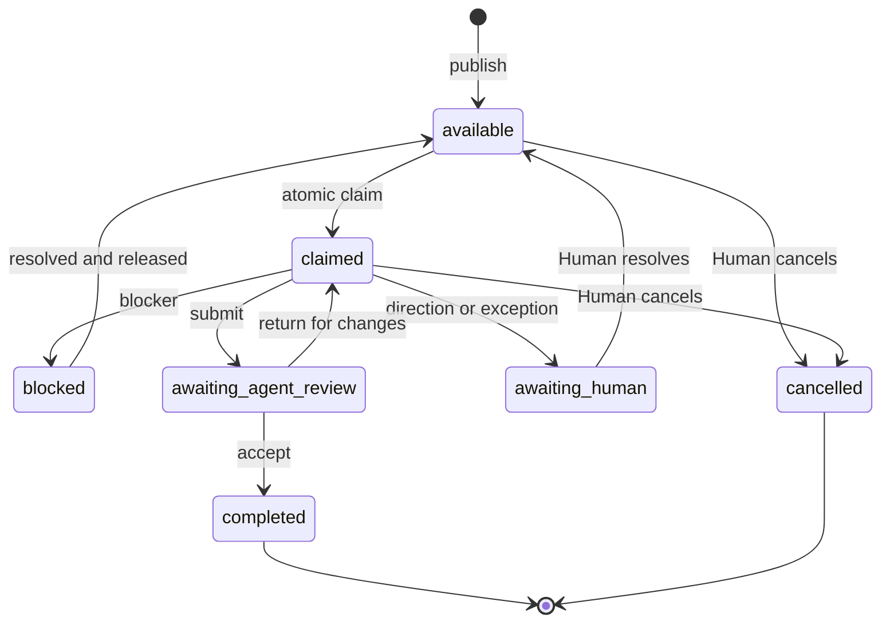
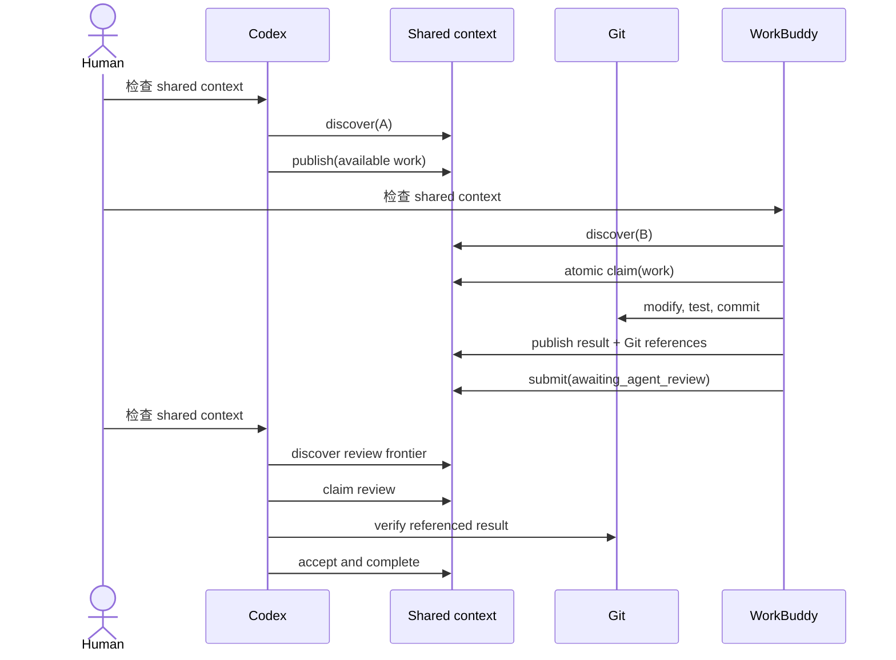

# Agent 自服务协作候选无关技术设计

状态：Experience Version implementation baseline

对应 Spec：[Agent 自服务协作](../prds/agent-self-service-collaboration.md)

## 设计目的

本设计定义产品语义、黑盒验证方式和 Experience Version 的职责分界。它不指定生产部署；当前已授权的实现只覆盖同设备单项目最小纵向切片。

## 系统边界

ZAgenticOPN 是窄职责的 collaboration control plane，只管理 private collaboration context、shared coordination facts 和 Work Item 生命周期。它不是通用记忆平台、中央智能调度器或完整工作流引擎。



## 逻辑组件



Experience Version 可以把这些逻辑组件放在一个进程和一个数据库中。组件图表达责任，不要求拆成服务。

## 上下文模型

```text
private collaboration context
  owner: one agent_instance
  content: observations, unpublished draft, recovery summary, references
  visibility: owner only

shared coordination context
  owner: initiative/project collaboration scope
  content: work, claims, results, blockers, next actions, decisions, references
  visibility: eligible Agents and Human

canonical Git facts
  owner: referenced repository
  content: code, Spec, Plan, commit, test evidence, release facts
```

Agent 必须显式 publish 才能把 private observation 变为 shared fact。shared context 保存摘要和引用，不复制完整对话、代码仓库或大文件。

## 领域对象

| 对象 | 最小责任 |
| --- | --- |
| Human | 产品目标与例外决策主体。 |
| Device | 可辨识的 Agent 运行设备。 |
| AgentInstance | 稳定主体；由 device 与 Agent runtime 实例区分。 |
| CollaborationScope | Initiative/project 隔离单位。 |
| WorkItem | 可独立 claim、执行和验收的协作单元。 |
| Claim | WorkItem 当前唯一执行权。 |
| CoordinationEvent | 可观察的 publish、claim、block、submit、review、complete 事实。 |
| EvidenceReference | 指向 Git commit、Spec、Plan、文件或测试结果的 canonical reference。 |

Human、Device 和 AgentInstance 的生产级认证方式 Deferred；Experience Version 仍必须能稳定区分两个参与实验的 AgentInstance。

## Work Item

最小 Work Item：

```text
id
scope
objective
acceptance
state
claimant
result_summary
next_action
references[]
revision
```

`revision` 只用于证明并发 claim 的产品语义；完整幂等、fencing 和断网恢复 Deferred。

## 状态模型



低风险 Work Item 可以按策略从 `claimed` 提交后直接 `completed`。第一条 Codex → WorkBuddy → Codex 实验必须包含 `awaiting_agent_review`，以验证 R8。

## 领域操作

候选需要原生提供或通过明确适配完成以下语义：

| 操作 | 成功结果 |
| --- | --- |
| `discover(agent, scope)` | 只返回该 Agent 当前 eligible 的 available 或 awaiting-review Work Items。 |
| `inspect(work)` | 返回完成工作所需的 shared facts 与 canonical references。 |
| `publish(work)` | 创建满足最小字段和 acceptance 的 available Work Item。 |
| `claim(work, agent, revision)` | 并发竞争时恰好一个 Agent 获得执行权。 |
| `publish_result(work, claim, result)` | 保存 result summary、next action 和 references。 |
| `block(work, claim, blocker)` | 明确阻断原因及需要的下一动作。 |
| `submit(work, claim)` | 进入 awaiting-agent-review 或完成。 |
| `claim_review(work, reviewer)` | 非执行 Agent 获得一次 review 工作。 |
| `review(work, decision)` | 接受、退回或升级 Human。 |

协议最终可由 HTTPS API、MCP、CLI 或 skill 投影；Experience Version 只实现参与实验的两个 Agent 所需的最小接入面。

## Human-triggered 时序



Human 的三次动作只是选择并激活 Agent，不包含 Work Item id、任务内容、前序结果或接续提示。

## Conformance scenarios

每个候选以固定版本接受相同黑盒场景：

| ID | 场景 | 必须观察到的结果 |
| --- | --- | --- |
| C1 | Publish and discover | B 仅凭通用触发发现 A 发布的 eligible work。 |
| C2 | Competing claim | 两个 Agent 同时 claim，同一 Work Item 只有一个成功且无重复执行。 |
| C3 | Result publication | B 的结果、next action 和 Git references 对 A 可见。 |
| C4 | Agent review continuation | A 仅凭 shared context 发现、claim 并完成 review。 |
| C5 | No eligible work | Agent 返回原因，不要求 Human 指定任务。 |
| C6 | Context defect | 缺少 acceptance 或 reference 时产生可分类缺陷，不伪装成成功接续。 |
| C7 | Scope isolation | 默认查询不混入另一 project 的 work；显式全局查询可展示跨项目引用。 |
| C8 | Private recovery | 原 Agent 中断后使用私有摘要恢复，另一 Agent 无法读取。 |

C1–C4 是淘汰门。候选缺少其中任一项，只有在适配责任仍可控时才进入 B/C 评估。

## 产品健康投影

每次实验产生 Markdown scorecard，包含：

- 固定输入目标与 acceptance；
- Human activation 与 task-specific intervention；
- discover、claim、publication、review 的可观察事件；
- AgentInstance 与 scope；
- Git commit、文件和测试 references；
- 最终 acceptance；
- failure category；
- Spec 定义的七项产品健康指标。

不保存 Agent 的隐含推理。第一阶段不要求 metrics backend 或 Dashboard。

## 候选比较方法

```text
Effective fit = functional coverage × semantic match × composition feasibility

Owned responsibility = missing semantics + adapters + composition
                     + operations + upgrades + security/data governance
```

先用 C1–C4 和 R5/R6/R8 淘汰，再比较完整 R1–R12。每项标记 `native / adapted / absent / unknown`，并固定候选 commit 和一手证据。

当前基线：

| 候选 | 主体价值 | 核心缺口 | 当前分类 |
| --- | --- | --- | --- |
| MineContext | 本地上下文采集与检索 | R5、R6、R8 | 非核心能力参考，不作主系统。 |
| MyContext | 私有上下文、隔离、lease 和健康模型参考 | 共享控制面、R5、R8 | C 类单位能力参考。 |
| TencentDB-Agent-Memory | 共享 memory/metadata、身份、ACL、HTTP Gateway | 原生缺少 R5、R6、R8 | C 类底座 fallback。 |
| ZAgenticLoop | Legacy 项目；有历史 OPN 思路 | 未完成首个体验版且复杂度失控 | 不开发、不预设复用。 |
| 待提供的新开源项目 | 待固定版本审计 | 待验证 | comparison gate 输入。 |

## Experience Version 边界

候选决策通过后，第一条纵向切片只需要：

- 两个稳定可区分的 AgentInstance；
- 一个 shared coordination store；
- 最小 Work Item；
- discover、atomic claim、publish result、awaiting-review continuation；
- Git references；
- 实验事件和 Markdown scorecard。

真实仓库实验只在隔离分支或实验仓库中修改、测试和 commit。自动 push、merge 和 release 不属于闭环。

## Deferred Decision Register

| 决策 | 重新进入条件 |
| --- | --- |
| 自动发现、轮询、通知和设备唤醒 | 三阶段实验通过，且 activation count/time 证明 Human 激活成本值得优化。 |
| 完整 private memory 与知识库 | private recovery 证明最小摘要不足，或新的产品 Feature 被接受。 |
| 生产级身份、凭证和 ACL | 持续运行、接入真实敏感数据或扩大到其他 Human。 |
| 幂等、fencing、复杂 lease 恢复 | 重试、迟到写入或崩溃在实验中成为阻断性失败。 |
| HA、备份、灾难恢复和 SLO | 进入 Dogfood 或发布准备，并形成运行承诺。 |
| 实时 Dashboard 与完整 telemetry | Markdown scorecard 无法支撑 sweeper 的实际查看频率和数据量。 |
| 团队治理、自动 merge/release | 个人闭环持续有效后，作为独立 Feature 重新 grill。 |

## 方案完成标准

第三方 Agent 仅凭 Spec、本设计和 roadmap，即可：

1. 解释 Feature 1 与方案 A 的差别；
2. 用 C1–C8 测试任意候选；
3. 区分原生能力、适配能力和 ZAgenticOPN 自有责任；
4. 知道当前授权只覆盖同设备单项目最小纵向切片；
5. 生成可复核的 A/B/C/D 推荐。
