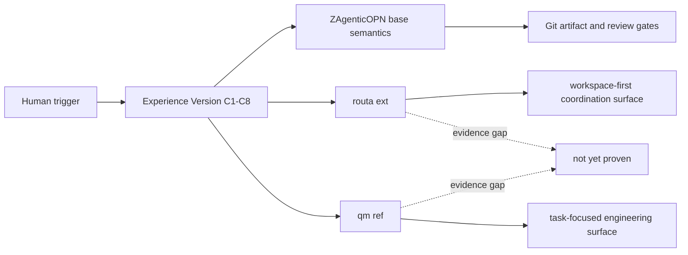
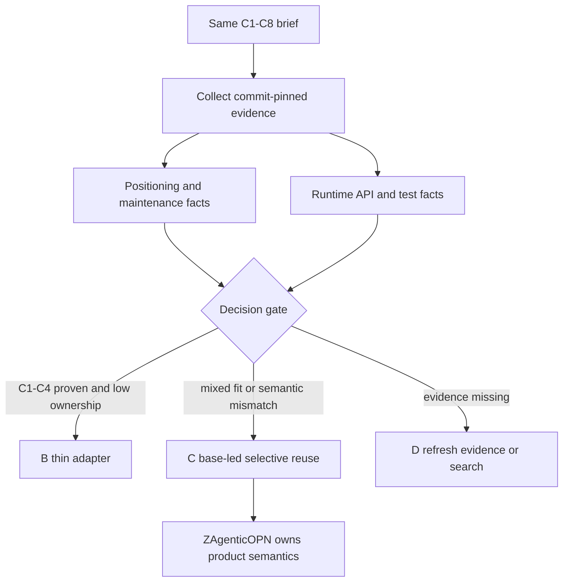

# 调研主题
ZAgenticOPN Experience Version：Routa 与 qm 的 C1–C8 conformance 对比

本轮对 phodal/routa（ext）与 yc-software/qm（ref）运行同一份 Experience Version C1–C8 brief。Routa 的固定版本明确呈现 workspace-first multi-agent coordination platform 定位，qm 的固定版本呈现 task-focused 工程维护、memory notebook、sweeper 与 fresh-context review 习惯；但 20 条 sealed evidence 全部来自 AGENTS.md，尚不足以证明任一候选通过 C1–C4 的自服务协作闭环。当前决策不是 A/B/C 采用，而是 D：补采真实 runtime/API/test 证据；ZAgenticOPN 继续拥有 Work Item、claim、结果发布、review、scope 与 private/shared context 语义。

## 输入材料与观察时间
Evidence ledger: `cf516aac71b245c5e285fd649958630c132d63f41bc9fc3f390789401ca30048`
Observed: 2026-08-20T10:56:31.400Z

## Key-Value 概念索引
- Key: `experience-version` — 用 C1–C8 和 R5/R6/R8 约束一个可重复的 Agent 自服务协作最小闭环；它是产品 conformance 门，不是候选项目 feature 清单。
- Key: `evidence-status` — native、adapted、absent、unknown 必须分开；本轮主要是 unverified，不能把采集缺口写成 absent。
- Key: `routa-role` — routa 是 ext 候选：其 workspace-first 多 Agent 产品定位值得深读，但不能仅凭定位继承产品语义。
- Key: `qm-role` — qm 是 ref 候选：它是已知产品形态参照与工程实践参照，不自动成为 ZAgenticOPN 的实现底座。
- Key: `base-ownership` — ZAgenticOPN 保持 Work Item eligibility、原子 claim、结果/审查状态、scope isolation、private recovery 和 Git provenance 的最终所有权。
- Key: `decision-model` — A 整体复用；B 基于开源薄适配；C 自有语义主导并选择性抽取单位能力；D 补证据或继续搜索。当前为 D，未来可能落到 C。

Concepts: [[experience-version]], [[evidence-status]], [[routa-role]], [[qm-role]], [[base-ownership]], [[decision-model]]

## C4 System Landscape
### Experience Version conformance landscape

## 候选项目表
| Repository | Stars | Topic match |
|---|---:|---:|
| phodal/routa | 1796 | 8 |
| yc-software/qm | 13980 | 2 |

## 深读项目卡片
### phodal/routa（ext）
Routa 的固定版本将自己定位为 workspace-first multi-agent coordination platform，并区分 Web 与 Desktop/Axum runtime；它是当前更值得做产品表面与协作数据模型深读的 ext 候选。当前主要缺口是 C1–C4 的 Work Item、claim、结果发布与 reviewer continuation 证据，本轮证据强度为 positioning-only。

- Claim `routa-positioning`
- Claim `routa-conformance-gap`

### yc-software/qm（ref）
qm 的固定版本提供 task-focused 工程维护参照，涉及 shared helpers、memory notebook、sweeper 与 fresh-context review；它适合作为已知产品形态和工程实践的 ref。当前主要缺口是跨 Agent shared coordination 的 C1–C4 运行证据，本轮证据强度为 maintenance-surface-only。

- Claim `qm-maintenance`
- Claim `qm-conformance-gap`

## 方案族及适用场景对比
### comparison-product-positioning
约束：需要跨设备/跨 Agent 自服务协作产品面。选项：Routa 的 workspace-first 协作定位 vs qm 的 task-focused 工程参照。证据：Routa 有明确协作产品定位，qm 本轮主要暴露工程维护规则。取舍：Routa 更值得优先深读产品数据模型，但定位本身不能证明闭环；qm 仍保留 ref 价值。决策：两者都保留，暂不整体采用。

Claims: `routa-positioning`, `qm-maintenance`

### comparison-c1-c4
约束：C1–C4 是硬门。选项：把定位/维护文档当作能力证明，或补采 runtime/API/test。证据：两候选的 C1–C4 均只有 AGENTS.md 级证据。取舍：直接判通过会制造错误产品决策；补采成本可控且能复用同一 brief。决策：D，先补证据。

Claims: `routa-conformance-gap`, `qm-conformance-gap`, `evidence-quality`

### comparison-ownership
约束：不能把候选的全产品生命周期责任带入 Experience Version。选项：A 整体复用、B 薄适配、C base-led selective reuse。证据：当前没有任何候选证明完整 C1–C4，也没有证明 private/shared context 与 Git provenance 的语义一致。取舍：A/B 均过早，C 只应在单位能力通过 conformance 后使用。决策：ZAgenticOPN 保留产品语义所有权。

Claims: `base-semantics`, `decision-state`

### comparison-evidence-strength
约束：报告必须区分 unknown 与 absent。选项：把 unknownCriteria=0 解读为全覆盖，或按 evidence path 与运行行为分层。证据：20 条记录全部来自 AGENTS.md。取舍：前者会把文档存在误读成能力存在；后者保守但可复现。决策：将 C1–C4、R5/R6/R8 标为 unverified。

Claims: `evidence-quality`

### comparison-next-gate
约束：在 Human A/B/C/D 决策前必须有可重复的黑盒 conformance。选项：直接进入实现，或为 Routa/qm 补 Work Item/schema、claim transaction、review transition、scope filter、private checkpoint 与 tests。证据：现有记录不足以进入实现。决策：完成同一套 C1–C8 证据补采后再回到 1-1-4。

Claims: `decision-state`, `routa-conformance-gap`, `qm-conformance-gap`

## C4 Context/Container 与子主题图
### 从产品定位到可验证单位能力

## 关键技术指标矩阵
| Metric | Definition | Unit | Method | Condition | Expected |
|---|---|---|---|---|---|
| c1-publish-discover-pass-rate | 满足 task-agnostic Human trigger 后由 Agent 发布并由另一 Agent 发现 Work Item 的场景数除以总场景数 | % | 固定 fixture 连续运行三次，记录发布、发现和 Human 是否补充 Work Item ID | C1 fixture；必须 0 次任务特定 Human intervention | 100% |
| c2-competing-claim-conflict-rate | 同一 Work Item 被两个 Agent 同时获得执行权或执行的场景数除以竞争场景数 | % | 并发启动两个 claim 请求并核对持久化状态与 Git provenance | C2 fixture；每次使用相同 Work Item | 0% |
| c3-result-schema-completeness | 包含 result_summary、next_action、acceptance_status、blocker 与 references 的结果发布数除以完成发布数 | % | 解析 shared coordination record 并逐字段校验 | C3 fixture；失败结果也必须结构化 | 100% |
| c4-review-continuation-rate | reviewer Agent 无 Human context supplementation 完成 awaiting review 的场景数除以进入 review 的场景数 | % | 独立 reviewer 激活，记录发现、claim、验证、完成四个事件 | C4 fixture；Human 不复制上下文 | 100% |
| evidence-runtime-coverage | C1–C8 中至少有一条 source/API/schema/test 证据的 criteria 数除以总 criteria 数 | % | 按 evidence path 类型分类并去重 criterion | 正式 A/B/C/D 决策前 | 100%；C1–C4 必须含 test 或可重放 runtime evidence |
| human-intervention-time | Experience Version 完成一次闭环所需的 Human 补充时间 | minutes | 记录 trigger、补充上下文、重试、review 和发布的 Human 时间 | 与方案 A 同一真实任务、连续三次 | 不明显劣于方案 A |
| git-artifact-provenance-completeness | 结果中可追溯到 canonical Git commit、路径和状态的 artifact 数除以结果声明 artifact 数 | % | 由 reviewer 独立解析 references 并与 Git 查询比对 | 所有 completed Work Item | 100% |
| coordination-ownership-surface | 由 ZAgenticOPN 自有代码/规则负责的产品语义项数量与被候选隐式接管的语义项数量 | count | 按 eligibility、claim、result、review、scope、recovery、provenance 建立 ownership matrix | 任何候选接入设计评审 | 7 项核心语义均由 ZAgenticOPN 明确拥有 |

## 建议、限制与待验证事项
### recommendation-d-refresh-evidence
当前技术决策选 D：不开始产品 runtime，不把 Routa 或 qm 判为通过；先用同一 C1–C8 brief 补采固定 commit 的真实 source、API/schema、transaction 与 unit/integration/e2e tests。

Comparisons: `comparison-c1-c4`, `comparison-next-gate`

### recommendation-routa-deep-read
优先深读 Routa 的 Work Item/任务状态、workspace scope、claim/locking、result/review transition、recovery 与对应测试；只有找到 C1–C4 的可重放证据，才讨论 B 或 C。

Comparisons: `comparison-product-positioning`, `comparison-next-gate`

### recommendation-qm-deep-read
保留 qm 作为 ref，补采其产品运行入口、memory/task/control API、跨 Agent 共享机制和 review continuation 测试；不要把 fresh-context review 工程规则等同于产品协作闭环。

Comparisons: `comparison-product-positioning`, `comparison-c1-c4`

### recommendation-base-ownership
无论后续选择 A/B/C，ZAgenticOPN 都保留 Work Item eligibility、原子 claim、结果发布、review 状态、scope isolation、private recovery 与 Git provenance 的最终所有权。

Comparisons: `comparison-ownership`

### recommendation-human-gate
完成证据补采和 conformance report 后，再回到 roadmap 1-1-4，由 Human 明确选择 A 整体复用、B 薄适配、C 选择性抽取或 D 继续搜索；Agent 不替 Human 做该方向性决策。

Comparisons: `comparison-ownership`, `comparison-next-gate`

### recommendation-known-limit
已知限制：本轮 evidence 质量不足以判断部署、license、安全隔离、升级/回滚和跨设备可用性；这些不是当前否定结论，而是下一轮必须显式验证的 gaps。

Comparisons: `comparison-evidence-strength`

## 来源清单
- [phodal/routa@e48861ab81e2b30378fd32f05204a3ab424c4fec:AGENTS.md](https://github.com/phodal/routa/blob/e48861ab81e2b30378fd32f05204a3ab424c4fec/AGENTS.md) — Evidence `5f6c0af9de319315df194133`
- [phodal/routa@e48861ab81e2b30378fd32f05204a3ab424c4fec:AGENTS.md](https://github.com/phodal/routa/blob/e48861ab81e2b30378fd32f05204a3ab424c4fec/AGENTS.md) — Evidence `da576d41544fabf2b46a6468`
- [phodal/routa@e48861ab81e2b30378fd32f05204a3ab424c4fec:AGENTS.md](https://github.com/phodal/routa/blob/e48861ab81e2b30378fd32f05204a3ab424c4fec/AGENTS.md) — Evidence `d4b3e81f0bb3e3d983475d8a`
- [phodal/routa@e48861ab81e2b30378fd32f05204a3ab424c4fec:AGENTS.md](https://github.com/phodal/routa/blob/e48861ab81e2b30378fd32f05204a3ab424c4fec/AGENTS.md) — Evidence `ce96724ffd76bd270dee59a7`
- [phodal/routa@e48861ab81e2b30378fd32f05204a3ab424c4fec:AGENTS.md](https://github.com/phodal/routa/blob/e48861ab81e2b30378fd32f05204a3ab424c4fec/AGENTS.md) — Evidence `69c79a5f946680cdb21ca7e5`
- [phodal/routa@e48861ab81e2b30378fd32f05204a3ab424c4fec:AGENTS.md](https://github.com/phodal/routa/blob/e48861ab81e2b30378fd32f05204a3ab424c4fec/AGENTS.md) — Evidence `8dc54dceb6cca35467ee0546`
- [phodal/routa@e48861ab81e2b30378fd32f05204a3ab424c4fec:AGENTS.md](https://github.com/phodal/routa/blob/e48861ab81e2b30378fd32f05204a3ab424c4fec/AGENTS.md) — Evidence `f7900a311173fe47c0999657`
- [phodal/routa@e48861ab81e2b30378fd32f05204a3ab424c4fec:AGENTS.md](https://github.com/phodal/routa/blob/e48861ab81e2b30378fd32f05204a3ab424c4fec/AGENTS.md) — Evidence `c42d538a3ffe24a11d582cf3`
- [phodal/routa@e48861ab81e2b30378fd32f05204a3ab424c4fec:AGENTS.md](https://github.com/phodal/routa/blob/e48861ab81e2b30378fd32f05204a3ab424c4fec/AGENTS.md) — Evidence `659a60bf8959c2e457df44f8`
- [phodal/routa@e48861ab81e2b30378fd32f05204a3ab424c4fec:AGENTS.md](https://github.com/phodal/routa/blob/e48861ab81e2b30378fd32f05204a3ab424c4fec/AGENTS.md) — Evidence `eb07cbf8f00d98aec5e1a8de`
- [yc-software/qm@568252bd4e6da5288b239573abef972f3e16b3f9:AGENTS.md](https://github.com/yc-software/qm/blob/568252bd4e6da5288b239573abef972f3e16b3f9/AGENTS.md) — Evidence `387b5cda01cdc0cb5f97409e`
- [yc-software/qm@568252bd4e6da5288b239573abef972f3e16b3f9:AGENTS.md](https://github.com/yc-software/qm/blob/568252bd4e6da5288b239573abef972f3e16b3f9/AGENTS.md) — Evidence `4e66c9a7c2c53c129f478c58`
- [yc-software/qm@568252bd4e6da5288b239573abef972f3e16b3f9:AGENTS.md](https://github.com/yc-software/qm/blob/568252bd4e6da5288b239573abef972f3e16b3f9/AGENTS.md) — Evidence `84f989f13374ac678ee8d13d`
- [yc-software/qm@568252bd4e6da5288b239573abef972f3e16b3f9:AGENTS.md](https://github.com/yc-software/qm/blob/568252bd4e6da5288b239573abef972f3e16b3f9/AGENTS.md) — Evidence `4af8857b635f3c44a9ac44f6`
- [yc-software/qm@568252bd4e6da5288b239573abef972f3e16b3f9:AGENTS.md](https://github.com/yc-software/qm/blob/568252bd4e6da5288b239573abef972f3e16b3f9/AGENTS.md) — Evidence `110c60e2cabf92f6b5a28919`
- [yc-software/qm@568252bd4e6da5288b239573abef972f3e16b3f9:AGENTS.md](https://github.com/yc-software/qm/blob/568252bd4e6da5288b239573abef972f3e16b3f9/AGENTS.md) — Evidence `7fc2fac0ea5a4afd2cb93c1b`
- [yc-software/qm@568252bd4e6da5288b239573abef972f3e16b3f9:AGENTS.md](https://github.com/yc-software/qm/blob/568252bd4e6da5288b239573abef972f3e16b3f9/AGENTS.md) — Evidence `115b755f7fe511ce2b030251`
- [yc-software/qm@568252bd4e6da5288b239573abef972f3e16b3f9:AGENTS.md](https://github.com/yc-software/qm/blob/568252bd4e6da5288b239573abef972f3e16b3f9/AGENTS.md) — Evidence `5a40174ed9eead1c519acf5b`
- [yc-software/qm@568252bd4e6da5288b239573abef972f3e16b3f9:AGENTS.md](https://github.com/yc-software/qm/blob/568252bd4e6da5288b239573abef972f3e16b3f9/AGENTS.md) — Evidence `24d4444fd0bb617e24b8bfb9`
- [yc-software/qm@568252bd4e6da5288b239573abef972f3e16b3f9:AGENTS.md](https://github.com/yc-software/qm/blob/568252bd4e6da5288b239573abef972f3e16b3f9/AGENTS.md) — Evidence `6cd9c3a9266e48117e2cffd5`
