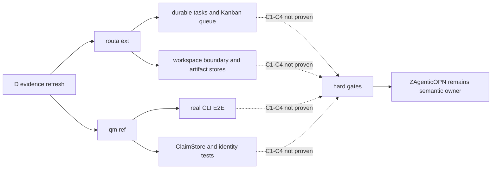
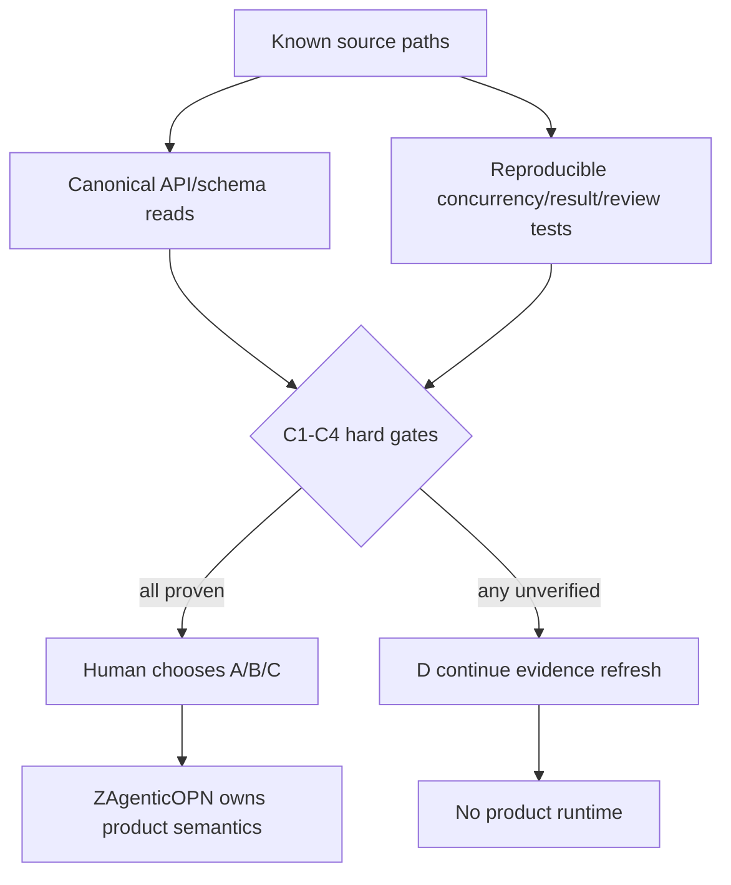

# 调研主题
ZAgenticOPN Experience Version：Routa 与 qm 的 runtime/API/test 证据补采

D 决策后的证据补采已从纯 AGENTS.md 推进到 Routa 架构文档、qm 真实 CLI E2E README 与 qm 的 ClaimStore 接口。Routa 暴露 durable tasks、Kanban queue、workspace scope、artifact/persistence 表面；qm 暴露真实二进制 E2E、隔离 pool/identity 测试和一个 claimFirst 接口。它们仍没有证明 C1–C4 的完整跨 Agent Work Item 闭环，因此 D 继续有效：补采固定 commit 的具体 API/schema 与并发、结果、review tests，暂不开始产品 runtime。

## 输入材料与观察时间
Evidence ledger: `fd607011d3a5c11868db69bad5868c0ba96faa71b26849ae9905d6cca43aa013`
Observed: 2026-08-20T11:07:41.170Z

## Key-Value 概念索引
- Key: `evidence-refresh` — D 阶段只补采 runtime/API/test 证据，不把候选实现接入 ZAgenticOPN。
- Key: `routa-runtime-signal` — Routa 的 durable tasks、Kanban queue、workspace boundary 与 artifact stores 是候选单位能力信号，不是 C1–C4 conformance 结论。
- Key: `qm-runtime-signal` — qm 的真实 CLI E2E、隔离 pool/identity 测试与 ClaimStore 接口提高证据强度，但 claimFirst 的语义仍需追到 Work Item 使用方。
- Key: `hard-gates` — C1 publish/discover、C2 competing claim、C3 result publication、C4 review continuation 仍是硬门。
- Key: `base-ownership` — ZAgenticOPN 继续拥有 eligibility、claim、结果/审查状态、scope、private recovery 与 Git provenance 语义。
- Key: `decision-state` — 当前仍为 D：补采固定 commit 的 API/schema/test；A/B/C 只有在硬门通过后才进入 Human 决策。

Concepts: [[evidence-refresh]], [[routa-runtime-signal]], [[qm-runtime-signal]], [[hard-gates]], [[base-ownership]], [[decision-state]]

## C4 System Landscape
### Runtime evidence refresh landscape

## 候选项目表
| Repository | Stars | Topic match |
|---|---:|---:|
| phodal/routa | 1796 | 8 |
| yc-software/qm | 13980 | 0 |

## 深读项目卡片
### phodal/routa（ext）
Routa 的架构证据已显示 durable tasks、Kanban queue、workspace boundary、dual backend 与 artifact/persistence stores。其 per-board concurrency 是 C2 的候选机制信号，但本轮没有跨 Agent Work Item claim transaction 或 C1/C3/C4 测试；状态为 signal-rich, conformance-unverified。

- Claim `routa-runtime`
- Claim `routa-gates`

### yc-software/qm（ref）
qm 的证据已显示真实 CLI E2E 会验证客观副作用、隔离 pool/identity 场景以及 ClaimStore.claimFirst 接口。claimFirst 当前位于 auth broker，尚未证明是 Work Item 执行权；状态为 test-rich, semantic-fit-unverified。

- Claim `qm-runtime`
- Claim `qm-gates`

## 方案族及适用场景对比
### comparison-runtime-surface
约束：候选必须有可运行、可追踪的协作基础。Routa 的 durable tasks/queue/workspace/artifact 表面更接近协作产品；qm 的真实 CLI E2E 与隔离/identity 测试更接近可验证运行基础。取舍：Routa 优先查协作数据模型，qm 优先查 claim 使用方；两者都不能直接替代 ZAgenticOPN 语义。

Claims: `routa-runtime`, `routa-stores`, `qm-runtime`, `qm-isolation`

### comparison-c1-c4
约束：C1–C4 是硬门。Routa 的 queue 防护与 qm 的 claimFirst 都只是候选机制信号，缺少跨 Agent Work Item 闭环测试。决策：C1–C4 继续 unverified，D 不变。

Claims: `routa-gates`, `qm-claim`, `qm-gates`

### comparison-scope-recovery
约束：需要 scope isolation 与 private recovery。Routa 有 workspace boundary 和 memory/runtime 表面；qm 有 isolated pool、identity 与 memory-first onboarding。取舍：均需继续追 source/test 才能证明 Experience Version 语义。

Claims: `routa-scope`, `qm-isolation`, `qm-memory`

### comparison-evidence-path
约束：证据必须来自固定 commit 的 canonical source/test。DeepWiki 只能选路径且本轮超时；因此下一轮直接读取已知路径比等待导航更可靠。

Claims: `navigation-limit`

### comparison-ownership
约束：不能因候选有局部机制就转移产品语义所有权。选项 A/B/C 仍需等待硬门；当前保持 ZAgenticOPN base-led，候选只提供待验证单位能力。

Claims: `base-semantics`, `decision-state`

## C4 Context/Container 与子主题图
### 从候选信号到 conformance 决策门

## 关键技术指标矩阵
| Metric | Definition | Unit | Method | Condition | Expected |
|---|---|---|---|---|---|
| c1-publish-discover-pass-rate | 另一 Agent 在 task-agnostic Human trigger 后发现并可执行 Work Item 的场景数除以总场景数 | % | 固定 fixture 连续三次，记录 publish/discover 与 Human 是否补充 Work Item ID | C1；Human 不指定 Work Item | 100% |
| c2-competing-claim-conflict-rate | 两个 Agent 同时获得同一 Work Item 执行权或实际执行的场景数除以竞争场景数 | % | 并发 claim 并核对持久化状态、执行日志和 Git provenance | C2；相同 Work Item | 0% |
| c3-result-schema-completeness | 包含 result_summary、next_action、acceptance_status、blocker、references 的结果数除以发布结果数 | % | 解析 shared coordination record 并逐字段校验 | C3；成功和失败结果均检查 | 100% |
| c4-review-continuation-rate | reviewer Agent 无 Human context supplementation 完成 review 的场景数除以 review 场景数 | % | 记录发现、claim、验证、完成四个事件 | C4；独立 reviewer 激活 | 100% |
| canonical-runtime-evidence-coverage | C1–C8 中至少一条 source/API/schema/test 证据的 criteria 数除以总 criteria 数 | % | 按证据 path 类型和 criterion 去重统计 | A/B/C/D 复核前；C1–C4 必须含 test 或可重放 runtime evidence | 100% |
| deepwiki-navigation-timeout-rate | DeepWiki 导航超时请求数除以 DeepWiki 请求总数 | % | 读取 sealed ledger navigation diagnostics | 每轮 research collect | 0%；超时必须可预测回退并保留诊断 |
| human-intervention-time | 完成一次 Experience Version 闭环所需 Human 补充时间 | minutes | 与方案 A 同一真实任务连续三次记录 Human 操作时间 | 不含初始目标下达 | 不明显劣于方案 A |
| git-artifact-provenance-completeness | 可追溯到 canonical Git commit、路径和状态的结果 artifact 数除以声明 artifact 数 | % | reviewer 独立解析 references 并与 Git 查询比对 | 所有 completed Work Item | 100% |

## 建议、限制与待验证事项
### recommendation-d-continue
继续 D：不开始产品 runtime，不把 Routa 或 qm 判为通过；直接补采固定 commit 的 Work Item/schema、claim 使用方、result/review transition、scope filter、private checkpoint 与对应测试。

Comparisons: `comparison-c1-c4`, `comparison-evidence-path`

### recommendation-routa-paths
Routa 下一轮优先读取 kanban、handoffs、tasks、review API 与 Rust/TypeScript integration tests，验证 durable task 是否真的提供 C1–C4 所需状态转移。

Comparisons: `comparison-runtime-surface`, `comparison-c1-c4`

### recommendation-qm-paths
qm 下一轮优先追 ClaimStore.claimFirst 的所有使用方、web-ui active-run/continuable routes、memory service 与对应 tests，判断它是否构成 Work Item claim/review 机制。

Comparisons: `comparison-runtime-surface`, `comparison-c1-c4`

### recommendation-base-ownership
无论候选后续落到 A/B/C，ZAgenticOPN 保留 eligibility、claim、result/review、scope、private recovery 与 Git provenance 的最终所有权。

Comparisons: `comparison-ownership`, `comparison-scope-recovery`

### recommendation-human-gate
完成下一轮 canonical source/test 补采后，再回到 roadmap 1-1-4 复核 A/B/C/D；Agent 不替 Human 把局部机制信号升级为产品采用决策。

Comparisons: `comparison-c1-c4`, `comparison-ownership`

## 来源清单
- [phodal/routa@e48861ab81e2b30378fd32f05204a3ab424c4fec:docs/ARCHITECTURE.md](https://github.com/phodal/routa/blob/e48861ab81e2b30378fd32f05204a3ab424c4fec/docs/ARCHITECTURE.md) — Evidence `14c2641f93a68d845626987c`
- [phodal/routa@e48861ab81e2b30378fd32f05204a3ab424c4fec:docs/ARCHITECTURE.md](https://github.com/phodal/routa/blob/e48861ab81e2b30378fd32f05204a3ab424c4fec/docs/ARCHITECTURE.md) — Evidence `a7bfbf014a952100eeb1c4b7`
- [phodal/routa@e48861ab81e2b30378fd32f05204a3ab424c4fec:docs/ARCHITECTURE.md](https://github.com/phodal/routa/blob/e48861ab81e2b30378fd32f05204a3ab424c4fec/docs/ARCHITECTURE.md) — Evidence `dd9041dea1e3e5e9d1af040c`
- [phodal/routa@e48861ab81e2b30378fd32f05204a3ab424c4fec:docs/ARCHITECTURE.md](https://github.com/phodal/routa/blob/e48861ab81e2b30378fd32f05204a3ab424c4fec/docs/ARCHITECTURE.md) — Evidence `04870f0cd9fe2641b42ba8f6`
- [phodal/routa@e48861ab81e2b30378fd32f05204a3ab424c4fec:docs/ARCHITECTURE.md](https://github.com/phodal/routa/blob/e48861ab81e2b30378fd32f05204a3ab424c4fec/docs/ARCHITECTURE.md) — Evidence `d4494fe4f8f272399ceefb35`
- [phodal/routa@e48861ab81e2b30378fd32f05204a3ab424c4fec:docs/ARCHITECTURE.md](https://github.com/phodal/routa/blob/e48861ab81e2b30378fd32f05204a3ab424c4fec/docs/ARCHITECTURE.md) — Evidence `c0d7076b2c8d5b0af8a48211`
- [phodal/routa@e48861ab81e2b30378fd32f05204a3ab424c4fec:docs/ARCHITECTURE.md](https://github.com/phodal/routa/blob/e48861ab81e2b30378fd32f05204a3ab424c4fec/docs/ARCHITECTURE.md) — Evidence `9d2c7ce28c570504c510429f`
- [phodal/routa@e48861ab81e2b30378fd32f05204a3ab424c4fec:docs/ARCHITECTURE.md](https://github.com/phodal/routa/blob/e48861ab81e2b30378fd32f05204a3ab424c4fec/docs/ARCHITECTURE.md) — Evidence `e6ff385f424cd394cc3c6b70`
- [phodal/routa@e48861ab81e2b30378fd32f05204a3ab424c4fec:docs/ARCHITECTURE.md](https://github.com/phodal/routa/blob/e48861ab81e2b30378fd32f05204a3ab424c4fec/docs/ARCHITECTURE.md) — Evidence `ce4296f3a1dec544efd818c3`
- [phodal/routa@e48861ab81e2b30378fd32f05204a3ab424c4fec:docs/ARCHITECTURE.md](https://github.com/phodal/routa/blob/e48861ab81e2b30378fd32f05204a3ab424c4fec/docs/ARCHITECTURE.md) — Evidence `217ae4ab5b0fe61e873788aa`
- [yc-software/qm@568252bd4e6da5288b239573abef972f3e16b3f9:cli/test/e2e/README.md](https://github.com/yc-software/qm/blob/568252bd4e6da5288b239573abef972f3e16b3f9/cli/test/e2e/README.md) — Evidence `e9620292ac1afb3908251092`
- [yc-software/qm@568252bd4e6da5288b239573abef972f3e16b3f9:cli/test/e2e/README.md](https://github.com/yc-software/qm/blob/568252bd4e6da5288b239573abef972f3e16b3f9/cli/test/e2e/README.md) — Evidence `99a6dfd32873e7c97661d8e6`
- [yc-software/qm@568252bd4e6da5288b239573abef972f3e16b3f9:cli/test/e2e/README.md](https://github.com/yc-software/qm/blob/568252bd4e6da5288b239573abef972f3e16b3f9/cli/test/e2e/README.md) — Evidence `3a8a1dd70646dea905417b4d`
- [yc-software/qm@568252bd4e6da5288b239573abef972f3e16b3f9:cli/test/e2e/README.md](https://github.com/yc-software/qm/blob/568252bd4e6da5288b239573abef972f3e16b3f9/cli/test/e2e/README.md) — Evidence `723e2028610d53fdb9afebcd`
- [yc-software/qm@568252bd4e6da5288b239573abef972f3e16b3f9:cli/test/e2e/README.md](https://github.com/yc-software/qm/blob/568252bd4e6da5288b239573abef972f3e16b3f9/cli/test/e2e/README.md) — Evidence `a52ae49edc686dbcaf618f35`
- [yc-software/qm@568252bd4e6da5288b239573abef972f3e16b3f9:plugins/onboarding/README.md](https://github.com/yc-software/qm/blob/568252bd4e6da5288b239573abef972f3e16b3f9/plugins/onboarding/README.md) — Evidence `4a6967334c1f9ead174eff56`
- [yc-software/qm@568252bd4e6da5288b239573abef972f3e16b3f9:plugins/onboarding/README.md](https://github.com/yc-software/qm/blob/568252bd4e6da5288b239573abef972f3e16b3f9/plugins/onboarding/README.md) — Evidence `1270989568d4203c8d554e66`
- [yc-software/qm@568252bd4e6da5288b239573abef972f3e16b3f9:plugins/onboarding/README.md](https://github.com/yc-software/qm/blob/568252bd4e6da5288b239573abef972f3e16b3f9/plugins/onboarding/README.md) — Evidence `2527b63cbb2b75f3b6cff78f`
- [yc-software/qm@568252bd4e6da5288b239573abef972f3e16b3f9:plugins/onboarding/README.md](https://github.com/yc-software/qm/blob/568252bd4e6da5288b239573abef972f3e16b3f9/plugins/onboarding/README.md) — Evidence `51cb2bc56f3b791c1d28d392`
- [yc-software/qm@568252bd4e6da5288b239573abef972f3e16b3f9:plugins/chassis/src/claims.ts](https://github.com/yc-software/qm/blob/568252bd4e6da5288b239573abef972f3e16b3f9/plugins/chassis/src/claims.ts) — Evidence `ba0dc47d5722293f8963155a`
