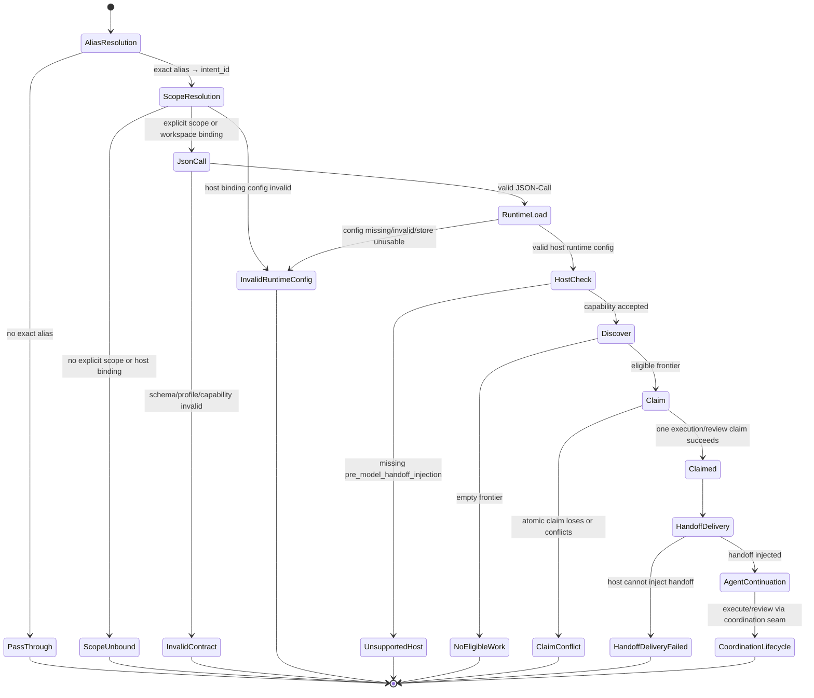

# Activation routing state machine

## Current intent of this document

This diagram is for maintaining activation behavior: alias resolution,
JSON-Call validation, runtime loading, discover, claim, receipt, and host
handoff. It does not replicate the product's entire lifecycle, and the diagram
does not replace the shared store's runtime facts. Execution, result
publication, review, reopen, and completion continue to use the coordination
seam and its receipts/events.

## Observable contract points

- Every call that enters the runner returns one structured receipt.
- `invalid_contract`, `invalid_runtime_config`, `scope_unbound`, and `unsupported_host` are
  rejection outcomes; when possible they write `activation_rejected`.
- `claimed` includes `handoff`, `work_id`, `next_action`, and `evidence`.
- A host delivery failure is recorded after claim as
  `handoff_delivery_failed`; it is not hidden by retry or cross-scope recovery.
- `config_updated_at` and `config_loaded_at` are UTC diagnostic timestamps in
  `YYYYMMDDHHMMSS[.SSS]Z` format.
